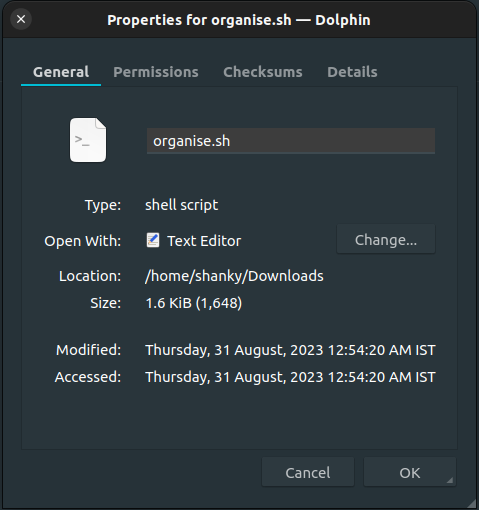
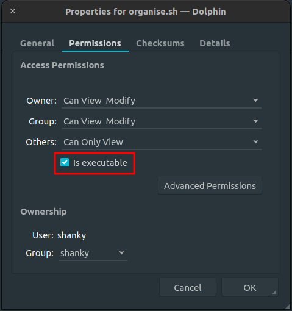
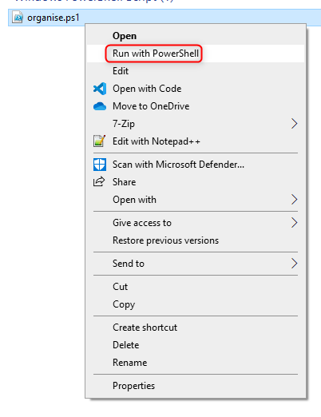

# file-organiser

## Introduction

Simple script(s) to organise files in their respective folders.

Credit for python file: https://www.youtube.com/watch?v=te3dabZ1Yts

from which I took inspiration to create bash script. I also went ahead and created a powershell script.

## File extensions supported

|  Folder   | Extensions                                                                |
| :-------: | :------------------------------------------------------------------------ |
|  Coding   | .sql, .yaml, .yml, .js, .ts, .c, .html, .xml, .json                       |
| Documents | .doc, .docx, .ppt, .pptx, .xls, .xlsx, .txt, .pdf, .odt, .ods, .odp, .csv |
|  Images   | .jpg, .jpeg, .png                                                         |
|   Music   | .mp3, .wav, .aac                                                          |
|  Videos   | .mp4, .mpeg, .mkv                                                         |

## How to Run:

- Download the release v1.0.0 and extract the contents of it in the folder you wish to organise.

- For organise.py file, you need to install python 3 (duh!)

  Then Open a terminal window, navigate to the directory where file is present, and issue following command `python organise.py`

- For organise.sh file, you need to give permission to it for execution:

  1. Either from File Manager:

     1.a. Right click on file and click on Properties

     

     1.b. Go to Permissions Tab and check 'Is executable'

     

     1.c. Click on OK.

  2. Or through terminal:

     2.a. Open terminal window, navigate to the directory where file is present, and issue following command `chmod +x organise.sh`

  You can then simply double-clik on the file to run it or run it from the terminal by issuing the command `./organise.sh`

- For organise.ps1 file you can simply right-click on the file and click on 'Run with Powershell'

  

  or open a powershell window, navigate to the file, and execute the command `.\organise.ps1`
